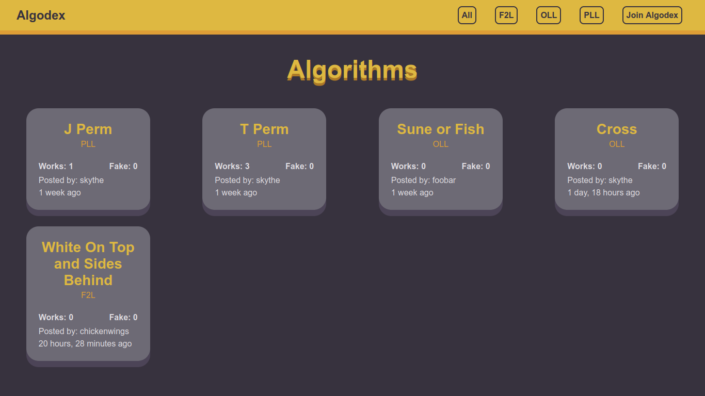
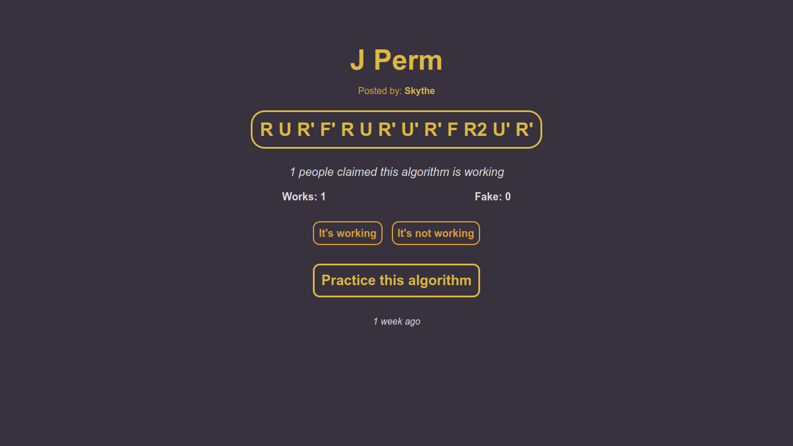
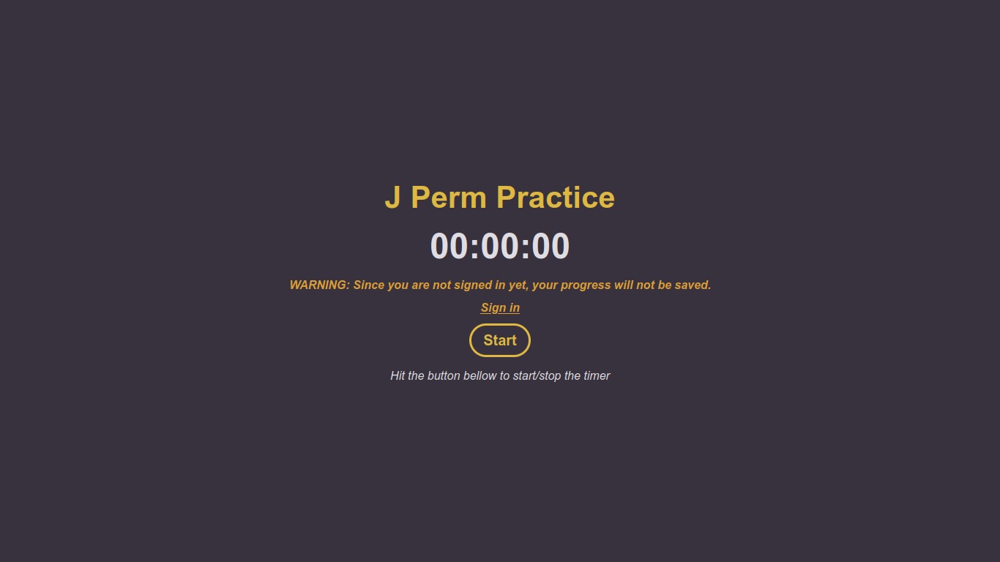
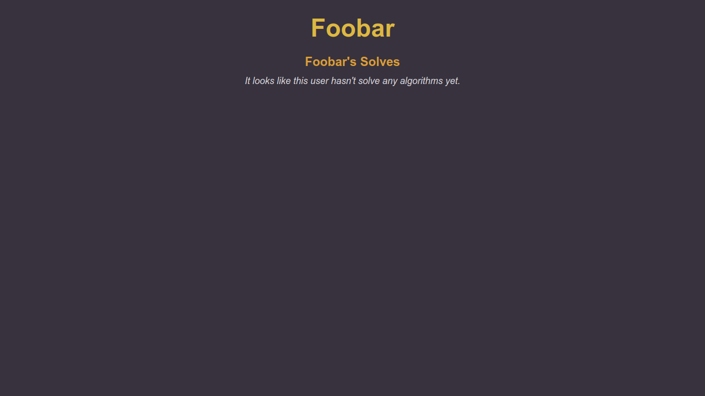
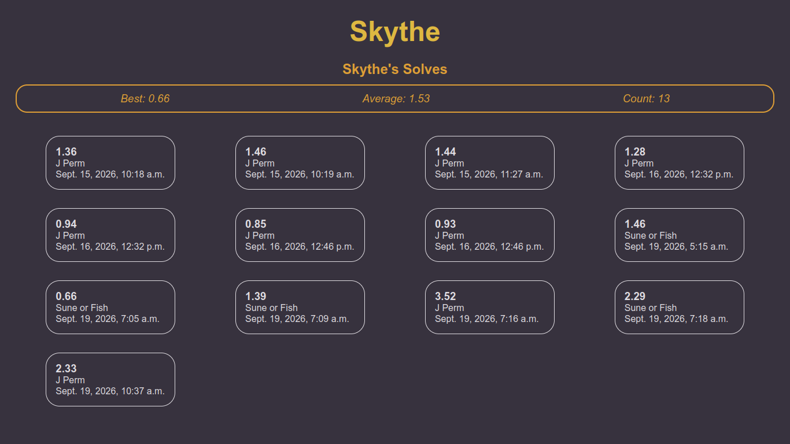

# Algodex: Master Rubik's Cube Algorithms Through Practice

## Overview

**Algodex** is an online tool that enables Rubik’s cube users to search for, learn, and practice different algorithms with ease. This website works for both casual and competitive speed cubers. The site enables users to interact with algorithms of all three methods (F2L, OLL, and PLL) of solving Rubik’s cubes and gives room for community voting and tracking of the user’s progress through time.

The website uses a freemium business model such that any user who accesses it as an anonymous user can search and practice with algorithms, but cannot save his or her solve times. A registered user will be able to upload a personal algorithm and vote on others.

## Screenshots








## Distinctiveness and Complexity: Why This Project Satisfies Requirements

### What Makes Algodex Distinctive

**1. Domain-Specific Problem Solving:** Algodex focuses on a particular and enthusiastic group of users—speedcubers who solve Rubik's cubes—and addresses a real problem they encounter: the fragmentation of algorithms. These cubers usually come across algorithms in YouTube videos, on Reddit forums, or in various notation documents. Algodex brings this knowledge together in a single platform that allows searching, voting, and practice. This is not a general-purpose social app; it has been specifically designed for a defined user group with particular requirements.

**2. Dual-Mode User Architecture:** Algodex enables users to explore and practice anonymously, thus reducing the barriers they face when first using the system, while at the same time encouraging them to create an account by keeping a record of the problems they have solved. Achieving this effect demanded careful conditional logic throughout the code and considered UX design—not an easy task.

**3. Real-Time Timer with Backend Persistence:** The practice timer is in fact the *heart <3* of Algodex, and achieving it involved true technical difficulty. Instead of using ready-made libraries or Django REST Framework (which would have increased the scope of the project, and I, indeed, too scared and lazy to do that), I designed a custom pipeline that translates JavaScript to Django by means of the Fetch API. For this it was necessary to:
   - Building a JavaScript stopwatch that accurately measures solve times
   - Sending timer data via POST request to a Django view without a REST API framework
   - Validating and persisting timing data on the backend
   - Preventing timing manipulation or cheating attempts
   
   The method known as 'custom integration' maintains a lean codebase while addressing a problem that simpler projects would completely ignore.

**4. Voting System with Duplicate Prevention:** The algorithm's voting function makes use of Django's `ManyToManyField` in order to stop users from being able to vote more than once on the same algorithm. Although this approach is mentioned in the Django documentation, getting it implemented correctly—by carrying out proper queryset checks, using atomic operations, and ensuring smooth coordination between the frontend and backend—shows a good understanding of Django's ORM and of relational database design.

**5. Profile Analytics:** The user's solve history is shown together with the timestamps and information about the algorithm. Achieving this involves extensive optimisation of the queryset (that is, filtering the Solve records by user and prefetching the related Algorithm data) and includes a simple yet effective analytics dashboard—which is a feature that provides real value to the platform.

### Technical Complexity Breakdown

- **Custom Fetch API Integration:** Without using Django REST Framework or REST library, managing JSON data transfer between JavaScript and Django required understanding of CORS, HTTP methods, CSRF tokens, and request/response cycles.
- **Conditional Authentication Logic:** Using `request.user.is_authenticated` throughout templates and views to conditionally render features (post algorithm, vote, save solves) added complexity to template logic and view functions.
- **Database Design:** The `Solve` model's `ForeignKey` to both `User` and `Algorithm` enables complex queries for user analytics and algorithm popularity tracking.
- **Form Handling with django-widget-tweaks:** Custom form rendering required configuration beyond Django's defaults, adding polish and usability to the UI.

In summary, Algodex is **not** a generic CRUD app reskinned for a different domain. It's a thoughtfully designed platform that solves a real niche problem, implements non-trivial authentication patterns, and showcases custom backend-frontend integration without relying on heavy frameworks.

---

## File Structure and Descriptions

### Backend (Django)

- **`manage.py`** – Django's command-line utility for project management.
- **`__init__.py`** – Package initialization file.
- **`settings.py`** – Django configuration (installed apps, middleware, database, static files, etc.).
- **`admin.py`** – Django admin interface configuration for managing `Algorithm` and `Solve` models in the backend.
- **`apps.py`** – Application configuration.
- **`forms.py`** – Django form definitions for user input (registration, algorithm creation, voting).
    - **`PostAlgorithm`** – ModelForm for creating algorithms; includes fields for name, category (F2L, OLL, PLL), moves, and description. Automatically handles validation and database insertion via `form.save()`.
- **`models.py`** – Database models:
  - **`Algorithm`** – Represents a Rubik's cube algorithm with name, category (F2L/OLL/PLL), move notation, description, creator, creation timestamp, yes/no vote counts, and a M2M field of voters to prevent duplicate votes.
  - **`Solve`** – Tracks individual practice sessions, recording the user, solve time (in seconds), algorithm practiced, and timestamp.
- **`tests.py`** – Unit and integration tests for views and models.
- **`urls.py`** – URL routing configuration mapping endpoints to view functions.
- **`views.py`** – Core application logic:
    - **`home()`** – Displays all algorithms or filters by category via GET parameter (`?category=F2L`).
    - **`algorithm_page()`** – Shows a single algorithm with name, creator, moves, description, and vote counts.
    - **`practice_page()`** – Renders the practice interface with timer; fetches user's previous solve times if authenticated.
    - **`create_page()`** – Allows authenticated users to post new algorithms; sets the creator automatically to `request.user`.
    - **`voting()`** – Processes "yes" and "no" votes; validates that the user isn't the creator and hasn't already voted using the `voters` M2M field.
    - **`save_solve()`** – Handles POST requests from `timer.js` via Fetch API; parses JSON, validates, and creates `Solve` records.
    - **`profile_page()`** – Displays user profile with solve history and aggregated stats (best time, average, total count).
    - **`login_page()`** – Authenticates user credentials and creates a session.
    - **`register_page()`** – Creates new user accounts with validation (password match, username uniqueness).
    - **`logout_page()`** – Clears the user session and redirects to homepage.
- **`db.sqlite3`** – SQLite database (stores all users, algorithms, and solve records).

### Frontend (Templates & Static Files)

**Templates** (Django HTML templates with Jinja2 syntax):
- **`layout.html`** – Base template.
- **`home.html`** – Homepage displaying algorithm cards in a grid, filterable by category (F2L, OLL, PLL).
- **`algorithm_detail.html`** – Single algorithm view.
- **`practice.html`** – Interactive practice interface.
- **`profile.html`** – User profile page displaying.
- **`register.html`** – User registration form.
- **`login.html`** – Login form.
- **`create_algorithm.html`** – Form for authenticated users to post new algorithms.

**Static Files:**
- **`navbar.js`** – Handles mobile navigation menu toggle.
- **`timer.js`** – **Core timer logic:**
  - Stopwatch implementation (millisecond precision)
  - Start/Stop button event listeners
  - Fetch API POST request sending timer data to `submit_solve()` view
  - CSRF token handling for secure form submission
  - Client-side validation and error handling
- **`home.css`** – Homepage-specific styles (algorithm card layout, filter buttons).
- **`page.css`** – Page-specific styles (algorithm detail, practice interface).
- **`practice.css`** – Practice mode styles (timer display, button styling).
- **`profile.css`** – Profile page styles (solve history table, user info card).
- **`form.css`** – Form styles for register, login or create page.

### Project Configuration

- **`urls.py`** (main project) – Routes all requests to the `main` app's URL patterns.
- **`__init__.py`, `asgi.py`, `wsgi.py`** – Project initialization and server configuration files.
- **`requirements.txt`** – List of Python package dependencies.

---

## How to Run Your Application

### Setup Instructions

1. **Clone or download the project:**
   ```bash
   git clone <repository-url>
   cd Algodex
   ```

2. **Create a virtual environment (recommended):**
    ```bash
    python -m venv venv
    source venv/bin/activate  # On Windows: venv\Scripts\activate
    ```

3. **Install dependencies:**
    ```bash
    pip install -r requirements.txt
    ```

4. **Apply database migrations:**
    ```bash
    python manage.py migrate
    ```

5. **Create a superuser account (optional, for Django admin):**
    ```bash
    python manage.py createsuperuser

    Run the development server:
    bash

    python manage.py runserver

    Open your browser and navigate to:

    http://127.0.0.1:8000/
    ```

## Usage
- Browse algorithms: Visit the homepage to search and filter algorithms by category (F2L, OLL, PLL).
- Practice without an account: Click "Practice this algorithm" to use the timer. Your times won't be saved.
- Create an account: Click "Register" to set up a free account and unlock algorithm posting and vote tracking.
- Post an algorithm: Once logged in, navigate to "Post Algorithm" and fill in the form with your algorithm's name, category, move notation, and description.
- Vote on algorithms: Click "It's working" or "It's not working" to vote on algorithm quality (requires login).
- View your profile: Click "Profile" in the navigation to see your practice history and statistics.

## Additional Information
### Dependencies
All required Python packages are listed in requirements.txt:

    Django 3.2+ – Web framework
    django-widget-tweaks – Enhanced form rendering with custom CSS classes and attributes
    SQLite3 – Default database (built into Python)

**Key Design Decisions**

No REST API Framework: To keep the project scope manageable and focused on core functionality, I avoided Django REST Framework. Instead, the timer-to-database pipeline uses vanilla Fetch API and Django views—this reduced overhead while demonstrating understanding of HTTP fundamentals.

M2M Voters Field: Rather than creating a separate Vote model, I used Django's ManyToManyField with custom queryset checks to prevent duplicate votes. This keeps the schema lean and leverages Django's ORM strengths.

SQLite Database: Appropriate for development and small-scale deployment. No external database server required.

Responsive Design: CSS media queries and flexbox ensure the app works on mobile, tablet, and desktop devices—important for a practice app that users may access on phones at competitions.

Anonymous User Support: Most Algodex features work without authentication, lowering the barrier to entry for new users exploring the platform.

**Future Enhancements**

Algorithm Statistics: Track which algorithms are practiced most frequently and average solve times per algorithm.
Leaderboards: Display fastest solvers for each algorithm category.
Algorithm Comments: Allow users to leave detailed feedback and tips on specific algorithms.
Spaced Repetition: Recommend algorithms for practice based on historical solve times and intervals.
Export Solve Data: Allow users to download their solve history as CSV or JSON.
Algorithm Variants: Tag algorithm variations (e.g., "standard" vs. "alternate" for the same case).

## Conclusion
Algodex demonstrates full-stack web development proficiency: a Django backend with relational database design, custom authentication logic, and a responsive frontend with vanilla JavaScript integration. The project solves a niche problem with genuine technical depth, avoiding the pitfall of "generic CRUD with a theme." It's ready for speedcubers worldwide to master their algorithms.

> Sepcial thanks to CS50, Brian Yu, David Malan, people who help reviewing CS50W submission and all of the people who helped and contribute to CS50. You guys are the best! <3
